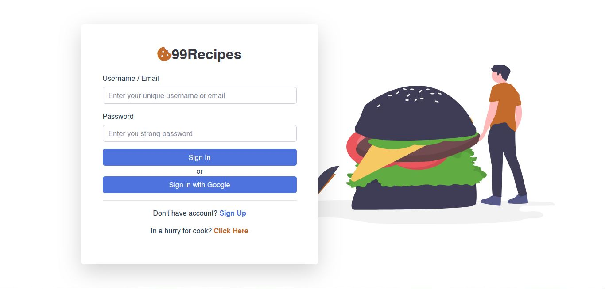
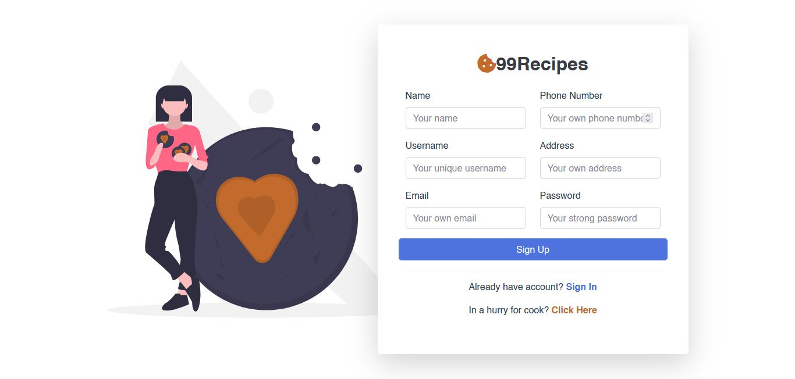
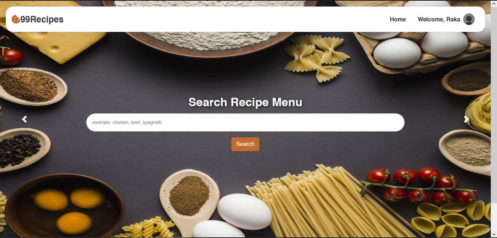
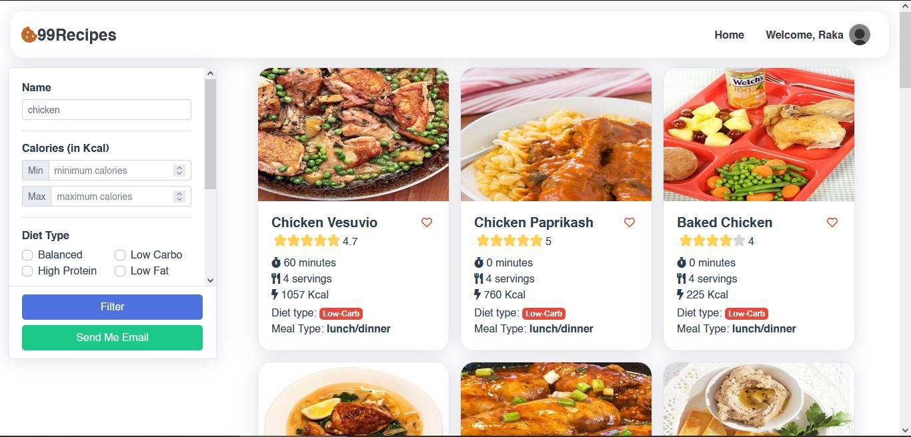

## Deploy links:

- Server (Heroku): https://our-99recipes-api.herokuapp.com
- Client (Firebase): https://our-99recipes.web.app/

  > **Dummy account**\
  > email: rakput@mail.com / username: rakput\
  > password: rakput123

# Update

Since Heroku updated its term and condition (free to paid), server on Heroku is no longer working as it should. If you need a demo, i can demo it on my local. Here some screenshots of this project:

1. Login and Register page
   
   

2. Home page
   

3. Recipe results
   

4. Recipe detail
   

5. Saved Recipes
   

6. Send random recipes to email
   
